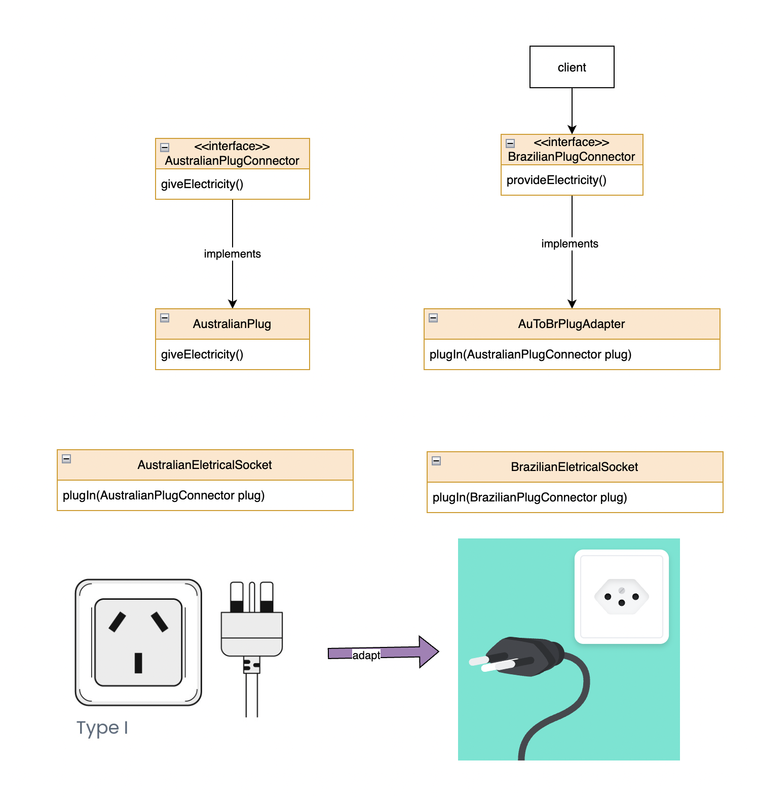

# Design Patterns with Java using TDD approach

### Adapter

Acts as a connector between two incompatible interfaces that cannot be connected directly.
The main goal is convert an existing interface into another one the client expects.

Implementation: [Main.java](src%2Fmain%2Fjava%2Forg%2Fjohnwick182%2Fadapter%2FMain.java)

**Target:** define the class that the client will use (I need to adapt AU connector to BR)
[BrazilianPlugConnector.java](src%2Fmain%2Fjava%2Forg%2Fjohnwick182%2Fadapter%2Fbr%2FBrazilianPlugConnector.java)

Adaptee: defines an existing interface that needs adapting. 
[AustralianPlugConnector.java](src%2Fmain%2Fjava%2Forg%2Fjohnwick182%2Fadapter%2Faus%2FAustralianPlugConnector.java)

Adapter: adapts the interface of Adaptec to the Target interface. The adapter itself 
[AuToBrPlugAdapter.java](src%2Fmain%2Fjava%2Forg%2Fjohnwick182%2Fadapter%2FAuToBrPlugAdapter.java)

